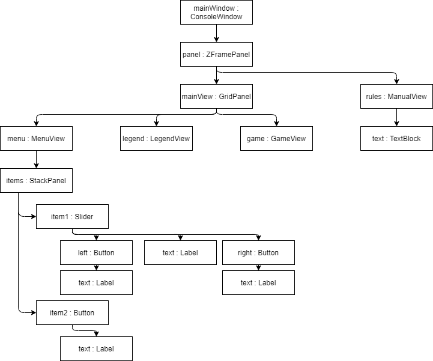

# SnakeAI 1.2 Erweiterung
Autor: Sergei Richter

Inhalt:
- [SnakeAI 1.2 Erweiterung](#snakeai-12-erweiterung)
- [Kontext und Ziel](#kontext-und-ziel)
- [Design, Vorbemerkungen, Grundüberlegungen](#design-vorbemerkungen-grundüberlegungen)
  - [Merging Algorithm (Testing)](#merging-algorithm-testing)
  - [Gewünschte Schnittstelle aus Programmierersicht](#gewünschte-schnittstelle-aus-programmierersicht)
  - [Benötigte Custom-Control](#benötigte-custom-control)
  - [Berechnung der Position und Grösse](#berechnung-der-position-und-grösse)
  - [Navigation](#navigation)
  - [Transparenz](#transparenz)
  - [Berechnung der Pixelwerte](#berechnung-der-pixelwerte)
- [Klassen](#klassen)
- [Backlog](#backlog)

# Kontext und Ziel
SnakeAI ist eime Umsetzung des bekannten Snake Spiels in der Konsole, welches für eine Umschulung bei Lutz&Grub entwickelt wird. Das Program existiert bereits in der Version 1.1.

Die Version 1.2 soll dabei die grafische Oberfläche erweitern. Die wichtigsten Ziele sind wie folgt:

<b>Funktionale Ziele und Features</b>
- Der Benutzer soll die Möglichkeit haben, seinen Namen einzutragen
- Die aktuellen Einstellungen sollen direkt im Menü sichtbar sein, teilweise z.B. als Slider
- Anstatt dem Highscore-View sollen auch andere Ansichten dargestellt werden
- Die Spielregeln und Programinfo soll als Fenster über allen anderen Fenstern angezeigt werden

<b>Visuelle Verbesserungen</b>
- Eine sterbende Schlange soll einpaar mal Blinken für visuelles Feedback (quasi eine Animation)
- Wenn eine Schlange ein Futter ißt, so soll das Futter die Schlange durch den Mange "hinabrutschen"


<b>Nicht-Funktionale Ziele und Features</b>
- Es gibt immer wieder Bugs wenn Elemente sich gegenseitig überzeichnen (z.B. wenn eine Schlange ein Futter ist), dies soll durch eine einheitliche Logik geändert werden. Insbesondere muss es ein Element bestimmen können, ob an einer Position ein leeres Zeichen gezeichnet werden soll, oder ob ein zu dem Objekt gehörendes Zeichen entfernt werden soll.
- Die Anordnung der Elemente soll automatisch erfolgen. So soll es z.B. möglich sein, einfach eine Art Liste zu erstellen welche automatisch die XY Position der Elemente darstellt.

 # Design, Vorbemerkungen, Grundüberlegungen

 ## Merging Algorithm (Testing)
 Es wurden folgende allgemeine Tests durchgeführt. Dabei wurde jeweils ein Array der Grösse 140x120, bzw. ein Console-Fenster der Grösse 140x120, befüllt. Es wurde im Debug Modus getestet.

 | ID | TEST | DAUER (ms) |
 |----|------|-------:|
 | 00 | Befüllen des Arrays mit fixen Daten, besteht aus jeweils 2 ConsoleColor und einem char | 0.9341
 | 01 | Befüllen des Arrays mit zufälligen Daten, besteht aus jeweils 2 ConsoleColor und einem char | 1.2412
 | 02 | Hinausschreiben von 140x120 einzelnen chars. Vor jedem Aufruf wird SetCursorPosition gesetzt, und es werden die zufälligen Farben gesetzt| 847.9288
 | 03 | Hinausschreiben von 140x120 einzelnen chars. Vor jedem Aufruf wird SetCursorPosition gesetzt, aber Farben werden nicht geändert| 363.5606
 | 04 | Hinausschreiben von 140x120 einzelnen chars. Vor jeder Zeile wird SetCursorPosition gesetzt, aber Farben werden nicht geändert| 218.9905
 | 05 | Hinausschreiben von 140x120 einzelnen chars. Weder wird SetCursorPosition() aufgerufen, noch werden die Farben gesetzt.| 190.9744
 | 06 | Hinausschreiben von 140x120 einzelnen chars. SetCursorPosition() wird nicht aufgerufen, die Farben werden gesetzt - aber immer die gleichen.| 730.3949
 | 07 | Hinausschreiben von 120 strings der Länge 140. Vor jedem Aufruf wird SetCursorPosition gesetzt. Es werden keine Farben gesetzt | 7.9949
 | 08 | Hinausschreiben von 120 strings der Länge 140. SetCursorPosition() wird nicht verwendet und es werden keine Farben gesetzt. | 5.5933
 | 09 | Hinausschreiben von 120 strings der Länge 140. SetCursorPosition() wird nicht verwendet, aber Farben werden gesetzt (pro Linie). | 11.7119
 
 
In der finalen Software möchten wir 50FPS, also 20ms/frame haben.

 Auf die Reihenfolge der Tests kommt es nicht an. Es ist also egal, ob man die Console mit Daten beschrieben hat und dann dieselben Buchstaben nochmals hinausschreibt.

<b>FOLGERUNGEN AUS DEM TEST:</b>
| AUFRUF | DAUER (&mu;s) |
|--------|--------------:|
| Zugriff auf Array Variable | 0.05
| Write(c), c ist ein char | 11.36
| 140 x Write(c), c ist ein char | 1591.45
| Write(s), s ist ein string mit s.Length = 140 | 46.61
| SetCursorPosition() | 10.27<br /> bis 233.46
| BackgroundColor = ConsoleColor.Black | 59.08

Zusammenfassung:
- Alle Aufrufe an die Console sind sehr teuer und es ist viel effektiver den zu schreiben Wert vorher zu berechnen
- SetCursorPosition() sollte vermieden werden
- Es ist viel besser Write(s) [s ist string] als mehrfach Write(c) [c ist char] zu benutzen
- Mehrfache Aufrufe an Background.Color und Foreground.Color sollten ebenfalls vermieden werden.

Logische Schlussfolgerung für einen Algorithmus:
- 'Tracke' welche Änderungen notwendig sind
- Gruppiere die Änderungen nach BackgroundColor, dannach nach ForegroundColor und schreibe zunächst alles heraus was diese Farben beinhaltet (denn das setzen der Farbe ist aufwendiger als das setzen des Cursors)
- Fasse die Änderungen zu strings zusammen, um Aufrufe von einzelnen Chars zu vermeiden
- Schreibe die strings in die Console hinaus

## Gewünschte Schnittstelle aus Programmierersicht

<b>Platzieren der Elemente</b>: Man würde gewisse, vorgefertige GUI Elemente zur Verfügung haben wie "Button", "DockPanel", etc. Diese hätten Properties welche die Platzierung steuern, wie z.B. ein Dimensions-Objekt welches die Grösse speichert. Die GUI Elemente könnte man dann zu einander hinzufügen, wie z.B:
```csharp
ConsoleWindow wnd = new ConsoleWindow();
wnd.Dimensions = new Dimensions() { Width = 140, Height = 120 };

DockPanel dp = new DockPanel();
dp.Dimensions = new Dimensions() { MaxWidth = 40, MinWidth = 20,  };
dp.Padding = new Distances() { Left = 2, Top = 2, Bottom = 2, Right = 3 };

Button btn = new Button();
btn.Alignment.Vertical = Alignment.Center;
btn.Alignment.Horizontal = Alignment.Stretch;

wnd.Add(dp, 0, 0);
dp.Add(btn, Dock.Top);
```

<b><u>Entwickeln neuer Elemente</u></b>: Es sollte eine Basis-Klasse (z.B. <b>ConsoleFrame</b>) existieren, von dem alle anderen Klassen abgeleitet werden.
```nomnoml
[<abstract>ConsoleFrame|
    + Visible : bool
    + Dimension : Dimension
    + Margin : Distances
    + Padding : Distances
    + ZPosition : int|
    # Write(x : int, y : int, text : string) : void
    # SetColor(x : int, y : int, length : int, color : Theme) : void
    # <virtual> OnInitializing() : void
    # <virtual> OnRefreshing() : void]

[ConsoleFrame] <:- [<abstract>AbstractFrame|
    # AdditionalProperty|
    # AdditionalFunction()]

[AbstractFrame] <:- [AnotherConcreteGuiElement|
    |
    # <override> OnInitialized() : void
    # <override> OnRefreshing() : void]
    
[ConsoleFrame] <:- [ConcreteGuiElement|
    |
    # <override> OnInitialized() : void
    # <override> OnRefreshing() : void]
```

Die Basis-Klasse <b>ConsoleFrame</b> übernimmt die gesamte Berechnung, an welcher eigentlichen Stelle etwas geschrieben wird, wie gross das Control ist, etc. Es bietet zwei Funktionen zum überschreiben an:
| Funktion | Aufruf-Zeitpunkt |
|----------|------------------|
| OnInitialized() : void | Wird nach der Berechnung der Grösse und Position aufgerufen (1x)
| OnRefreshing() : void | Wird periodisch aufgerufen, jedesmal wenn ein neuer Output berechnet werden soll

Weiterhin bietet die Klasse mehrere Funktionen an, um Werte tatsächlich zu schreiben. Wichtig ist, dass alle Positionsangaben relativ zu dem ConcreteControl geschehen - und zwar NACHDEM Margin, Padding, etc. berechnet wurden. Als Beispiel werden einige aufgeführt, aber nach Bedarf können noch weitere dazuprogrammiert werden:
| Funktion | Verhalten |
|----------|------------------|
| Write(x : int, y : int, text : string) : void | Schreibe den Text an die Position (x,y)
| SetColor(x : int, y : int, length : int, color : Theme) : void | Setze die Farbe der <em>length</em>-nächsten Zeichen, beginnend von <em>(x,y)</em>
| SetColor(line : int, color : Theme) | Setze die Farbe für die Linie
| Clear() : void | Lösche die gesamte Ausgabe vom Control
| ... | ...

Von dem <b>ConsoleFrame</b> können bereits konkrete GuiElemente abgeleitet werden. Aber es können auch weitere, abstrakte Klassen zwischen dem <b>ConsoleFrame</b> und dem konkreten GuiElement sein.

## Benötigte Custom-Control
Es folgt eine Liste aller Controls, welche umgesetzt werden sollen. Die Control werden in mehrere Gruppen unterteilt:
- ArrangementControls : Besitzen mehrere Kinder-Controls und die Hauptaufgabe ist es, diese Kinder anzuordnen
- InteractiveControls : Steuerelemente, welche eine gewisse Funktionalität beinhalten. Das Besondere an dieser Gruppe ist es, dass die GUI einen "Fokus" auf dieses Element legen kann wodurch gesteuert wird auf welches Element Benutzereingaben (also Tastendrücke) weitergereicht werden
- DisplayControls : Controls, welche nur der Darstellung dienen.
- Views: Die oberen Klassen weisen eine allgemeine Funktionalität auf. Diese werden benutzt, um <b>Views</b> zu erzeugen. Ein <b>View</b> ist dabei einfach nur eine Bezeichnung für ein UserControl, welches speziell für die Darstellung des Spiels, der AI, etc. verantwortlich ist (und in der Regel aus mehreren allgemeinen Controls besteht):

<b>ArrangementConrols</b>:
| Control | Hauptfunktion | Anwendung
|---------|---------------|----------
| StackPanel | Ordnet die Kind-Elemente untereinander an | Menü-Darstellung
| GridPanel | Ordnet Kind-Elemente in einem Gitter an | Allgemeiner Aufbau der GUI
| ZFramePanel | Zeichnet Kind-Elemente an die angegebene Position, nach einem Z-Wert sortiert an | Darstellung eines Info-Fensters, evtl. PopUps'
| SwitchPanel | Beinhaltet mehrere Kinder, aber zeigt zu einer gewissen Zeit nur eins an | Darstellung des Info-Bereichs: Highscore, AI Info, etc.

<b>InteractiveControls</b>:
| Control | Hauptfunktion | Anwendung
|---------|---------------|----------
| TextBox | Erlaubt dem Benutzer, Werte einzugeben | Eingabe von Benutzernamen
| Button | Kann vom Benutzer betätigt werden | Ruft Funktionen im Program auf
| Slider | Zeit Werte auf einem Balken von Links nach Rechts an | Eingabe von Spielgeschwindigkeit
| Table | Zeigt Werte in einer Tabelle an. Es können einzelne Zeilen ausgewählt werden | Highscore, Info's über die KI

<b>DisplayControls</b>:
| Control | Hauptfunktion | Anwendung
|---------|---------------|----------
| Label | Zeigt einen Text an, welcher sich ändern kann | Z.B. für die FrameCounter, FPS, Punktewerte, etc.
| TextBlock | Zeigt Text an, mit Zeilenumbruch | Für InfoView, LegendView
| Border | 

<b>Views</b>:
| Control | Hauptfunktion
|---------|--------------
| MenuView | Gibt dem Benutzer die Möglichkeit, das Spiel zu verwalten. Ändern der Settings, starten von einem Spiel, etc.
| GameView | Darstellung des Spiels
| GameStatusView | Darstellung von FPS, FrameCounter, Punkte, etc.
| HighscoreView | Darstellung des Highscores in einer Tabelle 
| ManualView | Beschreibt Steuerung und Regeln des Spiels
| LegendView | Kurze Beschreibung der wichtigsten Controls
| ConsoleAreaAdapter | Eine Wrapper-Klasse um die in Version 1.0 implementierte <b>ConsoleArea</b>-Klasse

<b>Sonstige Controls</b>:
| Control | Hauptfunktion
|---------|--------------
| ConsoleAreaAdapter\<T\> | Eine Wrapper-Klasse um die in Version 1.0 implementierte <b>ConsoleArea</b>-Klasse. Der Adapter benutzt nicht die neue Logik zur Synchronisierung von Werten, aber die Grösse der Elemente wird richtig berechnet. <b>T</b> ist dabei vom Typ ConsoleArea
| ConsoleWindow | Stellt ein tatsächliches Console-Fenster dar, hat u.A. Funktionen zur Steuerung der Fenstergrösse, Fonts, etc.

## Berechnung der Position und Grösse
Fundamental ist ein <b>ConsoleFrame</b>, ähnlich der <b>ConsoleArea</b>-Klasse aus Version 1.0, immer noch dafür verantwortlich, Elemente in nur einen bestimmten Bereich des Ausgabefensters zu zeichnen. Im Vergleich zu der <b>ConsoleArea</b>-Klasse, bei der der Bereich explizit über einen Punkt und eine Grösse angegeben wird, soll beim <b>ConsoleFrame</b> der Bereich automatisch berechnet werden - basierend auf Einstellungen welche der Programmierer trifft. Anders als die <b>ConsoleArea</b> Klasse ist die <b>ConsoleFrame</b> Klasse auch explizit darauf ausgelegt, dass Elemente sich "innerhalb" anderer Elemente befinden dürfen. 

Um dies zu erreichen, spielen folgende Ideen zusammen:

<b>Anordnung in einer Baumstruktur</b>:

Die einzelnen Elemente werden somit mit Hilfe der Panels und internen <b>ControlFrames</b> in einer Art Baumstruktur angeordnet, wie z.B:


Jedes ControlFrame besitzt ein Property "Children : ControlFrame[]". Dabei darf dass abgeleitete ControlFrame selbst entscheiden, ob von außen Kind-Controlframes hinzugefügt werden können. Als Beispiel:
- Ein StackPanel hat die Funktion <em>AddChild(ControlFrame frame)</em>
- Ein GridPanel hat die Funktion <em>AddChild(ControlFrame frame, int row, int col)</em>
- Ein Border hat die Funktion <em>SetChild(ControlFrame)</em>, denn ein Border kann nur ein Kindelement wrappen
- Ein Button bietet überhaupt keine Möglichkeit an, Kinder hinzuzufügen. Aber es setzt ein intern ein ControlFrame vom Typ "Label" als Kindelement.

<b>Grösse der Elemente</b>:

Die ControlFrames haben Properties zur Angabe der Breite und Grösse. Anders als in Version 1.0 können die Werte können dabei in folgenden <em>Modi</em> angegeben werden:
- <em>Absolute</em>: Die Grösse des Elementes wird direkt in Anzahl Pixel (also Konsolenzeichen) angegeben werden
- <em>Relative</em>: Die Grösse des Elementes wird relativ zu dem vom Elternframe bereitgestellten Bereich angegeben werden. Werte sind zwischen 0 und 100 und repräsentieren Prozentualwerte.
- <em>Minimal</em>: Die Grösse des Elementes ist so klein wie möglich, um den zu zeichnenden Content noch darzustellen.

Dabei kann der Modus für die Breite und Höhe unabhängig voneinander angegeben werden.

<b>Abstand zu benachbarten Elementen</b>:

Zusätzlich besitzt jedes ControlFrame noch folgende Properties:
  - Padding: Der Abstand von dem ControlFrame zu den Kind-ControlFrames. Default: 0,0,0,0
  - Margin: Der Abstand zu benachbarten ControlFrames. Default: 0,0,0,0

<b>Anordnung der Elemente</b>

Jedem ControlFrame kann auch mitgeteilt werden (über Properties), wie es im oberen Control ausgerichtet werden soll (links- oder rechtsbündig, zentriert). Dies kann sowohl in horizontaler als auch vertikaler Richtung erfolgen.

<b>Algorithmus zur Berechnung der tatsächlichen Grösse und Position</b>

Anhand der oberen Information wird bei dem Resize() Befehl die tatsächliche Position und Grösse des ControlFrames berechnet. Der Algorithmus ist dabei wie folgt:

- <em>CalculateMinSize() : Rect</em>: Zunächst wird, beginnend mit den untersten Kindelementen, die theoretische minimale Grösse bestimmt. Die benutzten Werte sind minimale/maximale Breite/Höhe, der Inhalt und Padding-Werte. Jedes abgeleitete ControlFrame muss dabei selbst bestimmen, wie wieviel minimale Grösse der Inhalt zur Verfügung. Ein Label würde z.B. den darstellenden Text messen, ein Panel würde die Kindelemete (einschliesslich der Margin-Werte) bereits anordnen.
- <em>CalculateMaxSize(Rect availableSpace)</em>: Anschliessend wird, beginnend mit den oberstem Element, die grösst-mögliche Fläche welche die Kinder zur Verfügung haben berechnet und die Baumstruktur nach unten weitergereicht, sodass die Kindelemente ebenfalls ihre Grösse - falls der Modus <em>Relative</em> ist - und die maximale Grösse deren Kinder berechnen können.
- <em>ArrangeElements()</em>: Im letzten Schritt werden die Elemente arrangiert (links/rechts-bündig, etc.) falls deren tatsächliche Grösse kleiner ist als deren zugewiesener Bereich.


## Navigation

## Transparenz


## Berechnung der Pixelwerte
# Klassen
# Backlog
| STATUS | Beschreibung |
|:------:|--------------|
|&#x2610;|Erstelle Klassendiagram
|&#x2610;|Beschreibe Algorithmus und Datenstruktur für die Berechnung der Pixelwerte
|&#x2610;|Refactor Version 1.0 mit einer ersten Implementierung von ConsoleFrame, ConsoleWindow und ConsoleAreaAdapter\<T\>. Es soll nur die Grösse berechnet werden, der Algorithmus zur Berechnung der Pixelwerte wird nicht umgesetzt und die verwendeten ConsoleArea's schreiben nachwievor direkt in die Console mit SetCursorPosition(..,..) etc.
