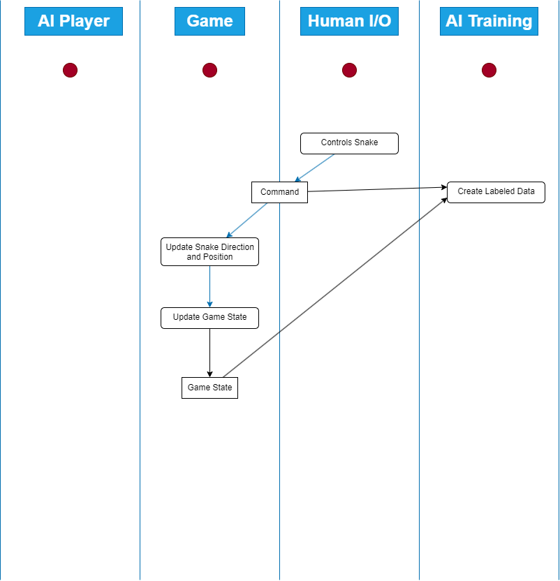

# K.I.

Die K.I. wird als neuronales Netzwerk implementiert. Für die Matrixberechnung und Zufallsgeneratoren wird die externe Bibliothek <em>MathNet</em> verwendet, aber ansonsten werden alle Algorithmen und Objekte (feed forward network, Backpropagation) selbst entwickelt.

Es soll später möglich sein, mehrere unterschieddliche K.I. Modelle/Strategien dem System hinzuzufügen, aber zunächst wird ein Model umgesetzt: die <em>MimicStrategy</em>

## MimicStrategy

Die MimicStrategy ist die Bezeichnung

### Erweiterung des Spielzyklus

Ein Spielzyklus bestand aus folgenden Schritten:

# ConsoleArea und -Window Erweiterung

# Multipayer Modus

# Backlog

# Änderungen während der Entwicklung