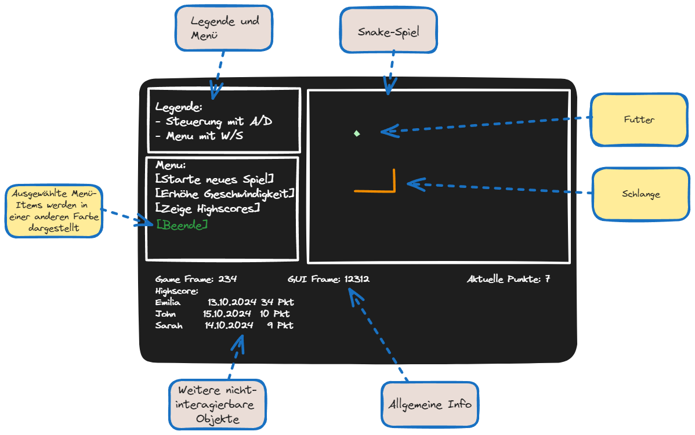
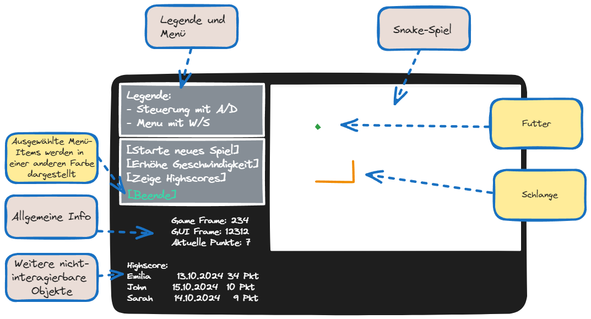

# Snake AI Documentation

Autor: Sergei Richter

#### Inhalt
- [Konzept](#konzept)
- [Komponenten](#übersicht-der-komponenten)
- [Backlog](#backlog-tasks)
- [Change Management](#change-management)


# Konzept

### LERN-ZIELE
  * Neuronale Netze lernen von absoluten
    Basics (keine Libraries)
    - Backpropagation
    - Genetische Algorithmen
  * Mit der Konsolenschnittstelle eine
    grafische Oberfläche erstellen
### GRUNDIEE
  * Ein Multiplayer-Snakespiel (auf nur
    einem Rechner)
    - Ein Spieler steuert eine Schlange von variabler Länge auf
      einem 2D-Spielfeld
    - Auf dem Spielfeld sind mehrere "Futter" verteilt
    - Ziel ist es, die Schlange auf ein Futter zu navigieren, wodurch
      die Schlange das Futter verspeist
    - Wenn die Schlange ein Futter verspeist, verlängert sich ihr Körper
    - Wenn die Schlange dabei an den Rand, auf sich selbst oder auf eine
      andere Schlange trifft, so stirbt sie und das Spiel ist verloren
    - Je länger die Schlange, desto mehr Punkte bekommt der Spieler am Ende
  * Schlangen können wahlweise von Menschen
    oder PC gesteuert werden
    - OPTIONAL: Tatsächlich mehrere menschliche Spieler. Erste Version nur ein Mensch.
  * Die K.I. kann selbst lernen, indem
    'tote' Snakes durch bessere Versionen
    ersetzt werden
    - OPTIONAL: Die K.I. lernt, indem Sie den Spieler nachahmt.
  * Der Lernvorgang kann auch über Nacht laufen
### REQUIREMENTS (funktional)
  * Spiel
    - Der Benutzer kann sich jederzeit selbst als "Schlange" hinzufügen
    - Der Benutzer kann jederzeit die Anzahl der K.I. Schlangen ändern
    - Eine Schlange kann entweder links, rechts oder gerade aus gesteuert werden
    - Anzahl der Futter variabel.
    - Spielfeldgrösse ist fest (z.b. 800x400)
  * Spielengine
    - Die Spielengine wird durch die Grafik nicht gebremst, damit die Berechnung
      auch beschleunigt werden kann.
  * Grafik
    - Das Konsolenfenster wird wie ein Window behandelt, d.h. es kommen keine neue
      Elemente hinzu sondern es werden die vorhanden überschrieben
    - Darstellung von Legende, Spielfeld und Tabelle mit Infos über Schlangen
      - OPTIONAL: Eine (K.I.) Schlange kann ausgewählt werden und deren
        Daten angezeigt werden.
    - Darstellung von Spielfeld: Rand, Futter und Schlangen auf de
      - Schlangen werden farbig unterschiedlich dargestellt, je nachdem ob diese
        die Spieler-Schlange oder K.I. Schlange sind
      - OPTIONAL: Körper der Schlangen wird durch vertikale und horizontale Striche
        dargestellt, je nach Ausrichtung
    - Darstellung von Tabelle mit Daten: Nummer der Schlange, Nummer der Generation
    - IDEE: Mehrere Konsolenfenster (prüfen ob es geht)
  * K.I.
    - K.I. Daten von Snakes werden gespeichert und wieder geladen,
      damit der Lernvorgang nicht von neuem beginnt
      - Will der Benutzer mehrere K.I. Profile, so muss er Dateien im Windows
        Explorer hin und her schhieben
### REQUIREMENTS (nicht funkt.)
  * Darstellung des Spiels mit 12fps (ruckelt, aber ok)
    - Effektiver Algorithmus, sodass nicht alles neu "gerendert" werden muss
  * Visualisierung in separates Projekt, damit bei Interesse durch richtige GUI
    ersetzt werden kann
### RISIKEN
  * Die Konsolenschnittstelle ist nicht schnell genug für ein flüssiges (12fps)
    Spielerlebnis.
    - Lösung: Proof of Concept mit Top-Prio
  * Die K.I. wird vllt. nicht (oder nicht schnell genug) auf ein brauchbares
    Ergebnis sich hinoptimieren.
    - Lösung A: Die K.I. mit ihren Schwächen und Fehlern lieben lernen.
    - Lösung B: Trainingsvorgang soweit abstrahieren, dass rel. schnell neue
      Trainingsalgorithmen umgesetzt werden können.
  * Zuviel vorgenommen:
    - Tag 1, Di: Konzept, Klassendiagram (grob)
    - Tag 2, Mi: Consolenfenster-Abstraktion
    - Tag 3, Do: Spiel + Spielersteuerung
    - Tag 4, Fr: K.I. Implementierung, Basics (Speichern, hinzufügen, Datenweiterleitung)
    - Tag 5, Mo: Trainingsalgorithmus
    - Tag 6, Di: Puffer, Abschluss
    - Lösung: Erstmal das Spiel programmieren. Wenn K.I. zuviel wird, so hat man
      zumindest ein Snake-Spiel

# Übersicht der Komponenten

Allgemeine Information:
- Im Folgenden wird nur das grundlegende Konzept der Anwendung dargestellt. Es werden NICHT alle privaten Felder etc. modelliert, sondern nur was für das grundlegende Verständnis notwendig ist.
- C# Properties werden als UML-Felder dargestellt
- Collections werden als Array dargestellt, unabhängig von der eigentlichen Implementierung (Liste, Qeue, ...)
- Einige beschriebenen Komponenten (wie AIManager) werden vermutlich nicht entwickelt und sind deswegen auch nicht fertig konzipiert. Dieses Dokument selbst W.I.P. und wird während der Entwicklung ständig aktualisiert.

## Hauptkomponenten
Der allgemeine Aufbau ist wie folgt:
```nomnoml
[<frame>SnakeAIConsole.exe|
  [ConsoleManager]
  [ControlManager]
]
[<frame>SnakeAICore.dll|
  [Game]
  [AiManager]
]
```

Die Anwendungen besteht aus zwei Projekten:
- SnakeAIConsole.exe (Konsolenanwendung)
- SnakeAICore.dll (Class Library)

Die SnakeAICore.dll beinhaltet dabei sowhl die gesamte Abstraktion des Spiels und der A.I. als auch nützliche Klassen, während die SnakeAIConsole für die Visualisierung und Weiterleitung der Benutzereingaben verantwortlich ist.

Beide Komponenten werden mit C# 8.0 entwickelt.


```nomnoml
[<abstract>ThreadedManager|
  + FramesPerSecond : int
  + <get> FrameCount : int |
  # ThreadedManager(numThreads : int)
  + Start() : void
  + Abort() : void
  + <abstract> Setup() : void
  # <abstract> Loop() : void
]

[ThreadedManager] <:- [ConsoleManager]
[ThreadedManager] <:- [ControlManager]
[ThreadedManager] <:- [Game]
[ThreadedManager] <:- [AiManager]
```

Die vier Klassen ConsoleManager, ControlManager, Game und AI werden bei Programaufruf initialisert und leben über die gesamte Programlaufzeit hinweg. Jede einzelne wird dabei in einem (oder mehreren) Thread ausgeführt und werden deswegen von der gemeinsamen Klasse "ThreadedManager" abgeleitet.

Die ThreadedManager wrapt einen Thread und verwaltet diesen. Die Idee ist:
- In jedem "Frame" wird dabei der Befehl Loop() ausgeführt und anschliessend wartet der Thread sodass die Anzahl der einzelnen Schritte pro Sekunde den Wert "FramesPerSecond" nicht überschreitet.
- Die Methoden Loop() und Setup() werden von den abgeleiteten Klassen überschrieben
- Exceptions welche in Loop() auftreten werden über das Event OnException nach außen signalisiert.
- Die Funktionen Start() und Abort() starten oder beenden den Thread.

#### Kommentare zum Design
- Die Aufteilung in SnakeAIConsole.exe und SnakeAICore.dll hat den Zweck, dass u.U. eine andere grafische Oberfläche auf SnakeAICore.dll aufgesetzt werden kann
- Die Aufteilung in die einzelnen Objekte "ConsoleManager", "Game", etc. hat den Zweck, dass diese Komponenten mit unterschiedlichen Geschwindigkeiten laufen können
    - ConsoleManager wird ca. mit 60FPS aktualisiert
    - Game wird während der Spielzeit mit 20FPS aktualisiert, aber in dem "Trainingsmodus" so schnell es geht
    - AIManager kann dabei auf mehreren Threads laufen, um mehrere Cores zu beanspruchen

#### Offene Fragen:
- Was ist die richtige Klasse für ein Thread in C# ?
- Wie synchronisiere/locke ich die Daten von den abgeleiteten Managern (wenn z.B. der ConsoleManager gerade auf Game Daten zugreift, während das Game Objekt diese aktualisiert)

#### Änderungen während der Entwicklung:
- Die Thread.Sleep(ms) Methode ist nicht besonders präzise. Es kann anscheinend Threads nur in Abständen von 1000/64 (ca. 16) Millisekunden pausieren. Deswegen ist in der aktuellen Implementierung eine präzise 'FPS' nicht möglich. Deswegen wurde stattdessen Thread.SpinWait(...) mit einer Stopwatch verwendet. Aber es wird noch nach besseren Methoden gesucht (da diese Methode sehr viel CPU frisst)


## Game
Die Game Klasse repräsentiert das Spiel. Es enthält alle Information über den aktuellen Status und berechnet in regelmässigen Abständen den nächsten Zustand. Die Regeln des Spiels sind wie folgt:
  - Ein Spieler steuert eine Schlange von variabler Länge auf
    einem 2D-Spielfeld
  - Auf dem Spielfeld sind mehrere "Futter" verteilt
  - Ziel ist es, die Schlange auf ein Futter zu navigieren, wodurch
    die Schlange das Futter verspeist
  - Wenn die Schlange ein Futter verspeist, verlängert sich ihr Körper
  - Wenn die Schlange dabei an den Rand, auf sich selbst oder auf eine
    andere Schlange trifft, so stirbt sie und das Spiel ist verloren
  - Je länger die Schlange, desto mehr Punkte bekommt der Spieler am Ende

Das Klassendesign sieht wie folgt aus:
```nomnoml
[Game|
  + BoardSize : Size
  + Foods : Food\[\]
  + Snake : Snake|
  + Game()
  + Setup() : void
  + SetFoodCount(cnt : uint) : void
  ~ GetRandomPoint() : Point
  # Loop() : void
]

[Snake|
  + Head : Point
  + Tail : Point\[\]
  + MoveDirection : Direction|
  + Snake(g : Game)
  + TurnLeft() : void
  + TurnRight() : void
  ~ Reset() : void
  ~ CheckCollision(food : Food) : void
  ~ CheckCollision(snake : Snake) : void
  ~ UpdatePosition() : void
  ~ UpdateState() : void
]

[Food|
  + Position : Point|
  + Food(g : Game)
  ~ Eat() : void
  ~ UpdateState() : void]

[<enum>Direction|
  Right
  Up
  Left
  Down]

[<abstract>IGameObject]

[<abstract>ThreadedManager] <:- [Game]
[Game] -> [Food]
[Game] -> [Snake]
[Snake] --:> [IGameObject]
[Food] --:> [IGameObject]
[Snake] -> [Direction]
```

#### Kommentare zum Design
- Food und Snake sind von IGameObject abgeleitet. Das Interface ist leer, aber es ermöglicht beide Elemente in einer Collection zu verwalten.
- Es ist wichtig, dass alle Collections threadsicher gemacht werden da auch die GUI über diese iteriert.

### Food
Repräsentiert ein Food-Objekt. Die einzige Information eines Food-Objektes ist die Position.

Wenn ein Food Objekt mittels der Eat() Funktion gegessen wird, so wird in der UpdateState() Funktion eine neue Position ermittelt. Es wird NICHT ein neues Objekt erstellt.

### Snake
Repräsentiert die Schlange. Besteht aus der aktuellen Kopfposition, eine Auflistung von Körperteilen und die aktuelle Bewegungsrichtung. Folgende Funktionen werden implementiert:
- TurnLeft() und TurnRight(): Ändert die MoveDirection
- Reset() : Setzt die Länge der Schlange zurück und bestimmt eine zufällige neue Position
- CheckCollision(Food) : Prüft, ob die Schlange gerade ein Food verspeist. Falls ja, so wird Food.Eat() aufgerufen und die Schlange wird in der UpdateState() Funktion um eins Verlängert
- CheckCollision(Snake) : Prüft, ob die Schlange mit einer weiteren Schlange kollidiert ist. Falls ja, wird die Schlange in der UpdateState() Funktion resettet. Der übergebene Wert kann dieselbe Schlange sein, dann wird geprüft ob die Schlange mit sich selbst kollidiert ist.
- UpdatePosition() : Bewegt die Schlange in die Richtung MoveDirection
- UpdateState() : Wird am Ende von Game.Loop() aufgerufen und aktualisiert die Daten der Schlange je nachdem ob diese ein Food gegessen hat oder mit einem Snake kollidiert ist.

### Game
Die Klasse welche das gesamte Spiel repräsentiert. Besteht aus der Brettgrösse und den Spielelementen (Foods und Snake).

Die entscheidende Funktion wird in der Loop() Funktion implementiert, welche von ThreadedManager überschrieben wurde. Der Ablauf ist.
1) Bewege die Schlange mit UpdatePosition()
2) Prüfe mittels CheckCollision() der Schlange für jedes Food und jede Schlange (momentan gibt es nur eine) ob es zu einer Kollision gekommen ist.
3) Aktualisiere dann die Elemente mit UpdateState()

Die anderen Funktionen der Klasse sind:
- SetFoodCount(cnt : int) : Setzt fest, wieviele Food-Items auf der Karte sich gleichzeitig befinden
- GetRandomPoint() : Gibt einen zufälligen, leeren, Punkt innerhalb der BoardSize Dimensionen zurück

## ConsoleManager
Der ConsoleManager ist für die Visualisierung des Spiels und anderen Elementen (Menü, Highscore-Tabelle, etc.) verantwortlich.

Das grafische Oberfläche soll in etwa wie folgt aussehen:



Die GUI wird wie folgt abstrahiert:
```nomnoml
[ConsoleManager|
    - Areas : ConsoleArea\[\]
    + Settings : Settings|
    + ConsoleManager(g : Game)
    + Setup() : void
    # Loop() : void
]

[ConsoleArea|
    |
    + ConsoleArea(g : Game, pt : point, sz : Size)
    + Write(pt : Point, text : string, clr : ThemeItem) : void
    + Refresh() : void
]

[MenuView]

[GameView]


[ThemeItem]

[ConsoleArea] --> [ThemeItem]
[ConsoleManager]1 o- *[ConsoleArea]
[ConsoleManager] o- [Settings]
[StorableData] <:- [Settings]
[<abstract>ThreadedManager] <:- [ConsoleManager]
[ConsoleArea] <:- [GameView]
[ConsoleArea] <:- [MenuView]
[ConsoleArea] <:- [(weitere Views)]
```

#### Kommentare zum Design
- Es werden mehrere 'Elemente' wie bei einer herkömmlichen GUI dargestellt und somit wird die Konsole etwas zweckentfremdet. Also anstatt einen fortlaufen Text zu schreiben, wird vorhandener Text stets ersetzt, und die Position kann dabei im ganzen Fenster verteilt werden.
- Es wird vermutlich NICHT möglich sein, dass man die Oberfläche Idioten-sicher gestaltet. Der Benutzer wird z.B. immer das Fenster verkleinern und vergrössern können welches die Darstellung verzehren wird.
- Die Berechnung vom Text, welcher geschrieben wird, darf etwas aufwendig sein da wir zwischen 2 "Updates/Refreshes" vermutlich 30-50 ms haben. Aber die Anzahl der eigentlichen Ausgaben sollte minimiert werden, da es zu unschönem Flackern kommt.
- Zum allgemeinen Design bzgl. der Interaktion zwischen dem Spiel und der Visualisierung:
  - Eine Möglichkeit wäre es, wenn das Spiel (über z.B. Events) Änderungen an die GUI mitteilt, sodass die GUI die Änderungen darstellen kann
  - Die 2te Möglichkeit ist es, dass die GUI selbstständig die Informationen vom Spiel abfragt und selbst prüft was sich geändert hat.
  - Die Entscheidung viel auf Option 2, denn: wenn das Spiel langsam läuft (z.B. 20fps), so wäre der Mehraufwand der Prüfungen zwar unnötig, aber würde keinen weiteren Nebeneffekt haben. Läuft das Spiel hingegeben schnell (>1000fps) - wenn man z.B. beim Trainieren relativ schnell Spiele simulieren will - wäre es nicht notwendig die GUI über jede Änderung zu informieren.

#### Offene Fragen:

#### Änderungen während der Entwicklung:

### ConsoleManager
Der ConsoleManager ist ein ThreadedManager, d.h. er hat einen eigenen Thread. Er hat im Wesentlichen drei Aufgaben:
- Er beinhaltet eine Collection von ConsoleArea Objekten, welche die eigentliche Darstellung der verschiedenen Bereichen übernehmen.
- Er hat einen Verweis auf ein Settings-Objekt, welches allgemeine Information über das Program speichert (z.B. Spielername, Highscore, etc.)
- In der Loop() Funktionen wird einfach Refresh() bei den einzelnen Areas aufgerufen. Die Area's selbst werden in der Setup() Funktion erstellt.

### ConsoleArea
Eine ConsoleArea ist ein "Wrapper" um die Console-Klasse (nicht im technischen Sinne, denn die Console Klasse ist statisch). Die Hauptaufgabe ist es, sicherzustellen dass der dargestellte Text nur in einem Bereich in der Konsole ausgeschrieben wird. Im Wesentlichen soll die ConsoleArea folgendes können:
- Die ConsoleArea 'versteckt' Funktionen von der Console wie Write, etc.
- Anders als bei Console wird beim Aufruf von ConsoleArea.Write(...) der Text nicht gleich in die Konsole geschrieben, sondern erst zwischen gespeichert.
- Beim Aufruf von Refresh() sollen nun alle zwischengespeicherten Texte hinausgeschrieben werden. Aber mit folgenden Bedingungen:
  - Die im Konstrukor übergebenen Dimensionen (pt, sz) müssen eingehalten werden
  - Es soll kein Text geschrieben werden, wenn der bereits in einem vorherigen Frame geschrieben wird. D.h., es wird nur etwas ausgegeben, wenn tatsächlich sich etwas geändert hat. Dies soll das "Flackern" minimieren.

### Theme und ThemeItem


```nomnoml
[Theme|
    + <static> Snake : ThemeItem
    + <static> Food : ThemeItem
    + <static> MenuItem : ThemeItem
    + <static> MenuItemSelected : ThemeItem
    ...]

[ThemeItem|
    + Foreground : ConsoleColor
    + Background : ConsoleColor]

[Theme] o- *[ThemeItem]
```
Da die meisten Objekte (Schlange, Futter, markierter Text, etc.) farbig dargestellt werden, gibt es diese einfachen Klassen um bestimmte Farbkombination an einer Stelle im Code zu speichern. Es wird KEIN variabler Theme-Wechsel oder ähnliches implementiert.

### GameView

```nomnoml
[GameView|
  - Views : IGameObjectView\[\]|
  + GameView(g : Game)
  + Refresh() : void
]

[<abstract>IGameObjectView|
  + GameObject : IGameObject|
  + Refresh() : void
  + Cleanup() : void]

[SnakeView|
  + GameObject : IGameObject
  + Snake : Snake|
  + SnakeView(area : GameView, snake : Snake)
  + Refresh() : void
  + Cleanup() : void
]

[FoodView|
  + GameObject : IGameObject
  + Food : Food|
  + FoodView(area : GameView, food : Food)
  + Refresh() : void
  + Cleanup() : void
]

[ConsoleArea] <:- [GameView]
[IGameObjectView] <:-- [SnakeView]
[IGameObjectView] <:-- [FoodView]
[GameView]1 +- *[IGameObjectView]
```
Der GameView zeichnet dabei das Spielfeld und die einzelnen Spielelemente.

Für jedes der beiden Spielelemente "Snake" und "Food" gibt es einen Wrapper, "SnakeView" und "FoodView". Die xxxView wissen dabei wie das entsprechende Element zeichnet und sind auch dafür verantwortlich es wieder aufzuräumen (wenn es z.B. stirbt).

Der GameView überprüft dabei regelmässig, ob neue "Food" oder "Snakes" im Spiel erstellt worden sind und erstellt dementsprechend neue Wrapper oder entfernt bereits vorhandene.


### MenuView

```nomnoml
[MenuView|
  - items : MenuViewItem\[\]
  + SelectedItem : MenuItem|
  + MenuView()
  + MoveUp() : void
  + MoveDown() : void
]

[MenuViewItem|
  - action : Action
  + DisplayText : string
  + IsSelected : bool|
  + MenuViewItem(displayText : string, action : Action, line : int)
  + Refresh()
  + Execute()
]

[ConsoleArea] <:- [MenuView]
[MenuView] o- *[MenuViewItem]
```

Der MenuView ist für die Darstellung des Menüs verantwortlich. Es selbst besteht es mehreren MenuViewItem's, welche ein einzelnes Menüfeld darstellen. In der ersten Version benehmen sich alle MenuViewItem's wie Buttons, d.h. sobald Sie ausgewählt und betätigt worden sind führen sie eine festgelegte Aktion durch.

## Control Manager
```nomnoml
[ControlManager||
    + ConsoleManager(g : Game, c : ConsoleManager)
    + Setup() : void
    # Loop() : void
]
```

Der ControlManager wartet in der Loop Funktion auf Eingaben vom Benutzer und ruft dann dementsprechend Funktionen in dem Game oder ConsoleManager Objekt durch, wie z.B:
```csharp
  var key = Console.ReadKey().KeyPressed;
  switch(key)
  {
    case ConsoleKey.Left:
      _game.Snake.TurnLeft();
      break;
    ...
  }
```

#### Kommentare zum Design
Für eine dermassen einfache Anwendung wird es vermutlich nicht notwendig sein, eine komplexe Hierarchie von "Command"-Objekten aufzubauen. Falls später Bedarf entsteht, so wird dementsprechend refactoring betrieben werden müssen.

## AiManager
Der AI Manager wird erst entwickelt wenn genügend Zeit bleibt. Deswegen wird hier auf ein detailliertes Konzept verzichtet.

## Weitere Klassen

```nomnoml
[<abstract>StorableData|
    |
    + StorableObject(path : String)
    + Write(path : string) : void
    + Read() : void
]
```
StorableData bietet eine vereinheitlichte Möglichkeit, Datenobjekte in Dateien zu speichern und wieder zu laden. Im Kern wird eine Json Serialisierung verwendet.


# Backlog (Tasks)

Zuerst aufgeführte Items haben höhere Priorität. Elemente unterhalb der doppelten Linie sind noch nicht priorisiert.
| STATUS | TIME | TOPIC | TASK |
|--------|------|-------|------|
|&#x2611;| 1 | CONCEPT |Erstelle erstes Konzept-Mindmap mit Ideen
|&#x2611;| 8 | CONSOLE |<b>Proof Of Concept</b><br />Erstelle eine Konsolenanwendung welches das Snake-Spiel in einfachster Form(ein Snake, ein Food, kein Menü, etc.) verwirklicht um zu prüfen ob die Konsolenanwendung überhaupt schnell genug auf Änderungen reagiert.
|&#x2611;| 5 | CONCEPT |Erstelle grobes Klassendesign und Backlog für Konsole und Spiel (AI ausgenommen)
|&#x2611;| 1 | BASE | ThreadedManager implementieren
|&#x2611;| 1 | GAME | Refactor Game, Food und Snake
|&#x2611;| 2 | CONSOLE | Implementiere ConsoleArea Klasse OHNE Abgleich welche Elemente überschrieben werden
|&#x2611;| 1 | CONSOLE | Refactor vorhandenen ConsoleManager
|&#x2611;| 1 | CONSOLE | Implementiere GameView
|&#x2611;| 2 | CONSOLE | Implementiere MenuView
|&#x2611;| 1 | CONSOLE | Refactor vorhandenen ControlManager
|&#x2611;| 1 | CONSOLE | Die Legende soll angezeigt werden
|&#x2611;| 2 | CONSOLE | Die Frame-Anzahl soll angezeigt werden
|&#x2611;| 1 | CONSOLE | Implementiere gute Synchronisationsmechanik für die Collections im Game Objekt
|&#x2611;| 1 | SOUND | Füge Sounds hizu, wenn die Schlange etwas isst oder stirbt
|&#x2611;| 1 | CONSOLE | Ändere die Font programatisch
|&#x2611;| 1 | CONSOLE | Die Game-Information soll an anderer Stelle dargestellt werden. Verbessere auch die benutzten Farben (für visuell angenehmeres Ergebnis)
|
|&#x2610;| | AI | Erstelle Konzept für A.I.
|&#x2610;| | GAME | Erstelle StorableData und die Settings-Klasse mit Highscore. Erstelle View für Highscore
|&#x2610;| | CONSOLE | Implementiere den Überschreib-Check in der ConsoleArea Klasse
|&#x2610;| | BASE | Finde Alternative zu Thread.SpinWait()
|&#x2610;| | BUG | Wenn der Spieler mehr Futter hinzufügt als möglich ist (z.B. da das Spielfeld begrenzt ist), gerät die Software in eine endlos-Schleife. Dies kann auch passieren, wenn die Schlange zu lang wird, sodass gar kein freier Platz mehr für ein neues Futter ist.
|&#x2610;| | BUG | Fügt der Spieler Futter im Sim-Modus hinzu und entfernt dann alle, so werden dennoch einige 'Geister' noch dargestellt. Tritt vereinzelt auf.
|&#x2610;| | BUG | Gelegentlich ist der gesamte Hintergrund bei Programstart grün.
|&#x2610;| | MENU | Der Benutzer soll seinen Namen eintragen können
|&#x2610;| | MENU | Erstelle eine Art Slider für die Einstellung der Spielgeschwindigkeit
|&#x2610;| | MENU | Der Benutzer kann auch die Lautstärke ändern
|&#x2610;| | CONSOLE | ConsoleArea Refactoring

# Change Management

Zum anfänglichem Konzept wurden folgende Änderungen während der Entwicklung vorgenommen

## Fonts
#### Problembeschreibung:
Das Spielbrett soll ein Gitter sein und die Schlange bewegt sich auf dem Gitter indem es die x oder y Position um eins ändert. Leider ist die Standard-Konsolen Schriftart nicht quuadratisch, wodurch sich die Schlange unterschiedlich schnell in die x oder y Richtung bewegt.

#### Ziel:
Die Schlange soll ich visuell gleich schnell horizontal und vertikal bewegen.

#### Lösung/Änderung:
Es wurde eine ConsoleHelper-Klasse hinzugefügt, mit der eine quadratische Schrift beim Programstart festgelegt werden kann:

```nomnoml
[ConsoleFontHelper|
    |
    + <static> SetFont(font : Font, int : height, int : width, bold : bool)
] --> [<enum>Font|
  LucidaConsole
  CourierNew
  Consolas]
```

Die Klasse benutzt Funktionen von der Windows Library: kernel32.dll.

Der Aufruf erfolgt innerhalb ConsoleManager.Setup().

#### Ungelöste Probleme:
Die Schriftart kann nur für das gesamte Fenster geändert werden. Deswegen sieht geschriebener Text nun in die Länge gezogen aus.
Für die Zukunft sollte das Spielbrett und das Menü in unterschiedlichen Fenstern dargestellt werden.


## ConsoleArea Aktualisierung
#### Problembeschreibung:
Ursprünglich war geplant, dass die ConsoleArea 'trackt' welche Änderungen notwendig sind und nur die notwendigen Änderungen einzeichnet. Dies kann u.U. ein entweder komplizierter oder resourcenfressender Algorithmus sein. Während der Entwicklung stellte sich heraus, dass
1. löst es das fundamentale Problem nicht, denn die einzelnen Objekte müssen sich dennoch "selbst" aufräumen
2. es nicht notwendig ist, denn die einzelnen Objekte (wie SnakeView) selbst entscheiden und prüfen können was neu gezeichnet werden muss
3. die ConsoleArea Klasse sowieso mehrere Unzulänglichkeiten hat (siehe [ConsoleArea Refactoring](#consolearea-refactoring)) und überarbeitet werden soll.

#### Lösung/Änderung:
Es wird kein globaler Algorithmus umgesetzt. Die zeichnenden Elemente (MenuViewItem, FoodView, SnakeView, ...) tracken ihre Änderungen selbst

#### Ungelöste Probleme:
Reihenfolge der Refresh() Aufrufe der Objekte ist sehr wichtig. Der Code ist deswegen sehr buganfällig.

## SyncQueue\<T\>
An mehreren Stellen im Program muss auf Collections aus mehreren Threads zugegriffen werden. So kann ein Thread einer Collection ein neues Element hinzufügen, während ein anderes darüber gerade iteriert. Deswegen braucht man eine threadsichere Collection. In der aktuellen Umsetzung wurde der Zugriff einfach über locks beschränkt und dies war ausreichend, aber der Code etwas unschön - ausserdem werden für die Übergabe ständig neue List\<T\> Objekte erstellt was unnötig ist.

Folgende Beobachtungen wurden gemacht:
- Die im Program verwendeten Collections sind alle Queue's (first-in-first-out).
- Es gibt immer nur einen schreibenden Thread, die anderen Threads lesen die Collections nur.
- Es gibt bereits mehrere thread-safe Collections, aber die, welche gefunden wurden haben nicht gewünschte Form da diese sowohl lesen/schreiben threadsafe machen (kann aber sein, dass es welche gibt - habe ich dann einfach nicht gefunden)
- Beim lesen wird immer die gesamte Collection kopiert, da wir die Daten für einen späteren Vergleich benötigen.
- Vor dem Lesen wird immer abgefragt, ob 

#### Lösung/Änderung:
Implementieren einer neuen SyncQueue\<T\>-Klasse, welche von der 

## Sound
#### Problembeschreibung:
Der Spieler erhält zu wenig Feedback wenn sich der Zustand der Schlange ändert.

#### Lösung/Änderung:
Spiele einen kurzen Sound ab wenn die Schlange ein Futter ist, oder stirbt. Dazu wurde eine neue Top-Level Komponente SoundManager erstellt, welche das Spiel überwacht und Sounds in gewissen Situationen abspielt:

```nomnoml
[<abstract>ThreadedManager] <:-- [SoundManager|
  |
  + SoundManager(g : Game)
]

[SoundManager] -> [SoundPlayer]
[<note>Aus System.Windows.Extensions.dll] - [SoundPlayer]
```

Die System.Media.SoundPlayer Klasse wird nicht selbst programmiert sondern von dem NuGet-Packet System.Windows.Extensions bereitgestellt.

#### Ungelöste Probleme:
Die SoundPlayer Klasse funktioniert nur unter Windows.

## ThreadManager
#### Problembeschreibung:
Die Aufgabe des ThreadManagers ist es sicherzustellen, dass die gewünschte FramesPerSecond für eine Komponente nicht überschritten wurde. Dazu wurde eine Kombination aus DateTime-Objekten und Thread.Sleep(ms : int) verwendet. Leider ist die zeitliche Auflösung beider Komponenten nicht ausreichend. Setzt man z.B. FPS=40 (also 25ms pro Thread), so dauert ein Thread manchmal 25ms, manchmal aber auch 40ms. Das ist ein für den Benutzer spürbarer Unterschied.

#### Lösung/Änderung:
Anstatt DateTime wird die präzisere Stopwatch benutzt. Die eigentliche Wartezeit wird mit einer Kombination aus Thread.Sleep(1) (Wartezeit 1-16ms Sekunden) und Thrad.Sleep(0) umgesetzt:

```csharp
// Wenn Wartezeit gross sein soll, benutze Thread.Sleep(1)
while ((_msPerFrame - stopwatch.ElapsedMilliseconds) > 16) Thread.Sleep(1);

// Wenn Wartezeit kurz sein soll, benutze Thread.Sleep(0)
while (stopwatch.ElapsedMilliseconds < _msPerFrame) Thread.Sleep(0);

return;
```

#### Ungelöste Probleme:
- Die aktuelle Lösung frisst sehr viel CPU Power
- Die tatsächliche Wartezeit bei Thread.Sleep(1) ist vermutlich abhängig von der Maschine bzw. OS. Somit haben wir unterschiedliches Verhalten auf unterschiedlichen Systemen.

## Anordnung GUI und Farben
#### Problembeschreibung:
Die ursprüngliche Anordnung der GUI Elemente war häßlich (subjektiv).

#### Lösung
Verwende folgendes Design:



## ConsoleArea Refactoring
#### Problembeschreibung:
Während der Entwicklung und arbeiten mit der ConsoleArea Klasse haben sich mehrere Design-Probleme offenbart. Ursprünglich war es als eine einfache Klasse gedacht, welche zwei Anforderungen erfüllt:

ANF1: Zunächst beinhaltet ConsoleArea Informationen über einen Bereich (Position und Grösse) und, vereinfacht gesagt, die Console.Write(...) Funktion wrapt mit der richtigen Position, z.B.
```csharp
class ConsoleArea {
  ...
  public ConsoleArea(Point topLeft, Size size) { ... }
  ...
  private void WriteToConsole(int x, int y, string text) {
    Console.SetCursor(TopLeft.X + x, TopLeft.Y + y);
    Console.Write(text);
  }
  ...
}
```

ANF2: Weiterhin sollte die Klasse gewünschte Änderungen im Output verfolgen und nur die Sachen tatsächlich hinausschreiben welche sich geändert haben, bei einem Refresh() Befehl. Wenn ein Objekt also z.B. mehrfach die Write Funktion aufruft, wie im folgenden Beispiel:
```csharp
  ConsoleArea area = new ConsoleArea(new Point(0,0), new Size(20, 20));
  area.Write(0, 0, "Hello World");
  area.Write(2, 0, "Hello World");
  area.Write(4, 0, "Hello World"):
  area.Refresh();
```
so soll nur ein einziges mal Console.Write("HeHeHello World") aufgerufen werden beim Refresh() Befehl.

Dies wurde auch so umgesetzt, aber es war teilweise unbequem damit zu arbeiten, denn:
- Das Anordnen der verschiedenen ConsoleAreas über Punkt und Grösse funktioniert, aber man hat den viele Magic-Numbers im Code. Insbesondere, wenn man Abstände zwischen den einzelnen ConsoleArea's haben möchte, hat man an verschiedenen Stellen +1, +2, etc. Werte. Weiterhin, wenn man z.B. Elemente unter zwei anderen Anordnen möchte, so muss man den neuen y-Wert berechnen
- Das Konzept ist, dass die ConsoleArea's verschiedene, sich nicht-überschneidende Bereiche repräsentieren. Aber es wäre bequem, wenn eine ConsoleArea sich innerhalb einer anderen ConsoleArea befinden kann. Das ist zwar auch in der aktuellen Umsetzung möglich, aber ANF2 ist dann nicht umsetzbar da das innere ConsolArea nichts von den Änderungen in dem äusseren ConsoleArea mitbekommt.
- Wenn mehrere Code-Baustellen dieselbe ConsoleArea benutzen, so ist deren Reihenfolge wichtig. Angenommen, die Schlange ist ein Futter an der Position (X,Y). Dann muss dass FoodView-Objekt Write(X, Y, ' ') aufrufen und die Schlange (X, Y, 'O'), wobei das Symbol 'O' für Schlangenkopf steht. Je nach Reihenfolge der Aufrufe erscheint dann entweder ' ' oder 'O'. Mann kann zwar damit umgeben (z.B. wenn man sicherstellt, dass die Schlange sich erst nachdem Futter zeichnet, oder wenn das Futter überhaupt nicht zeichnet) aber es ist sehr Buganfällig.
